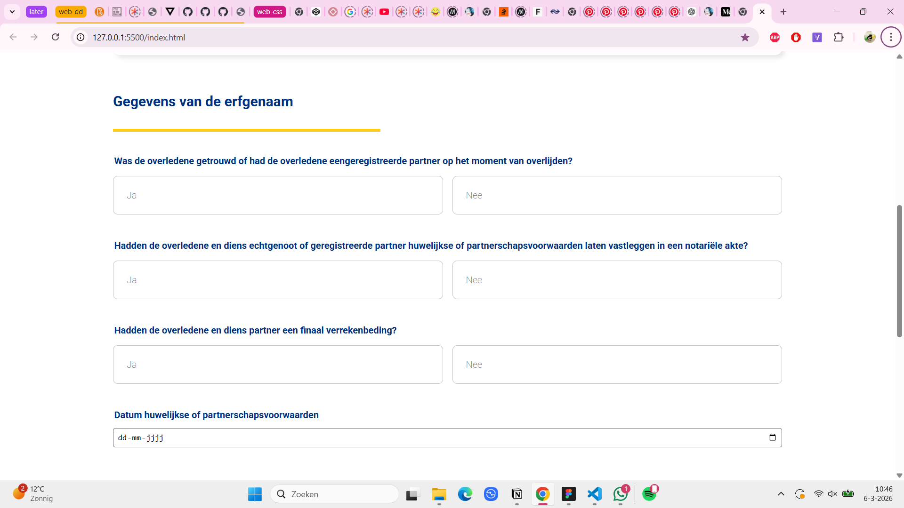
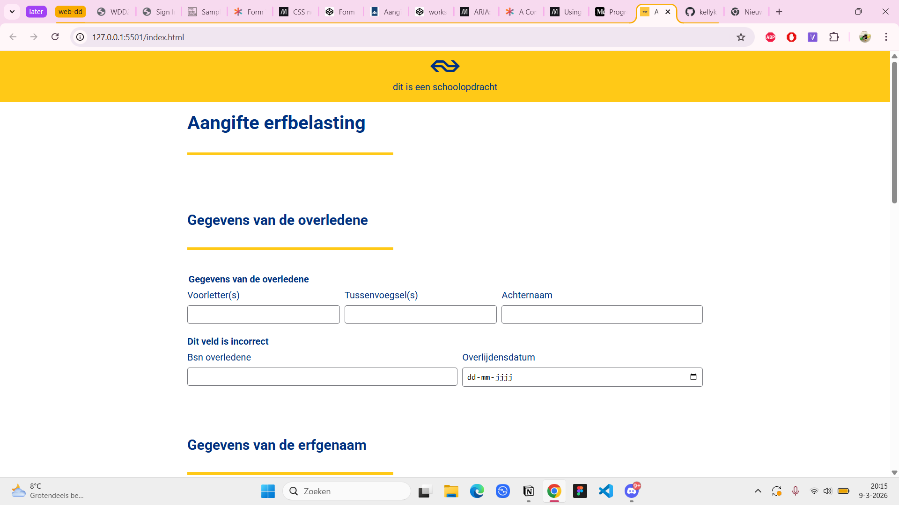
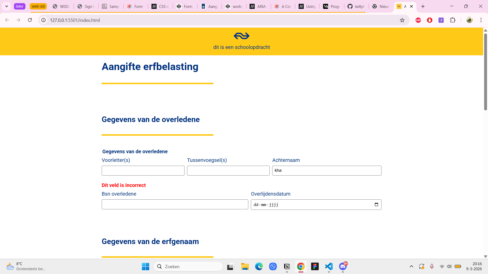
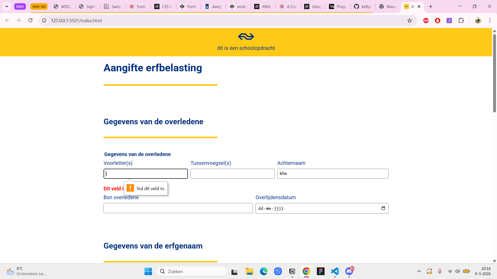
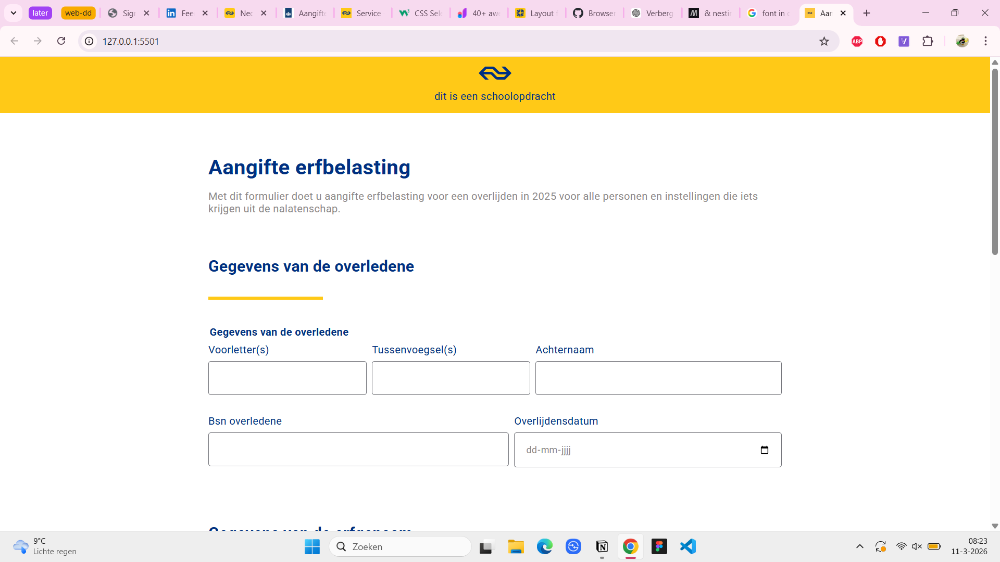
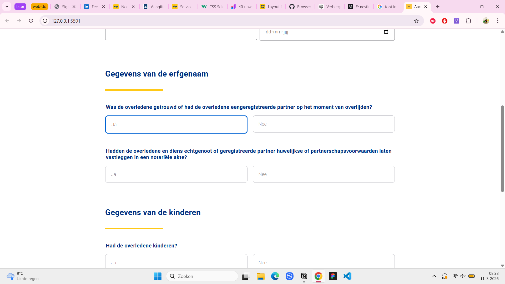
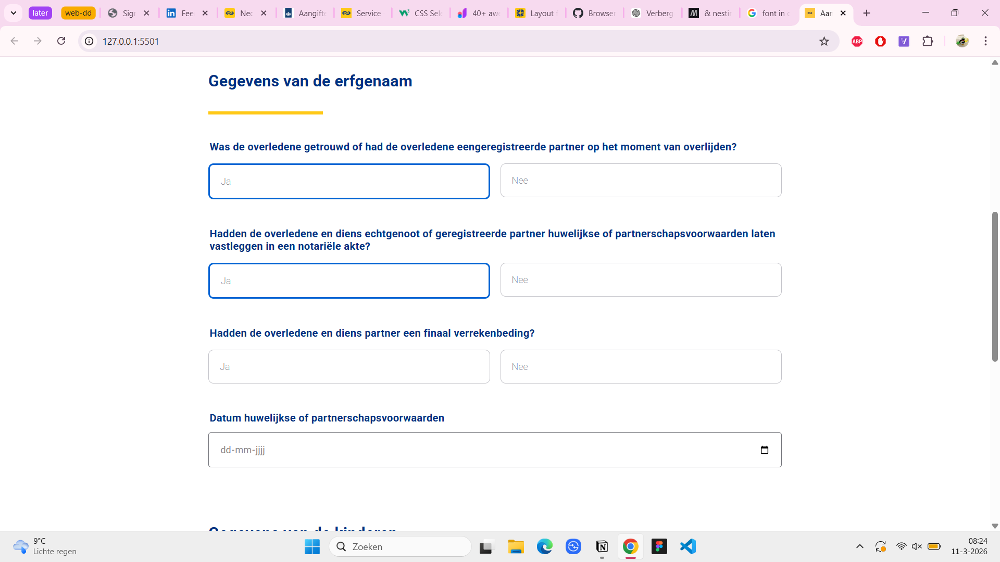
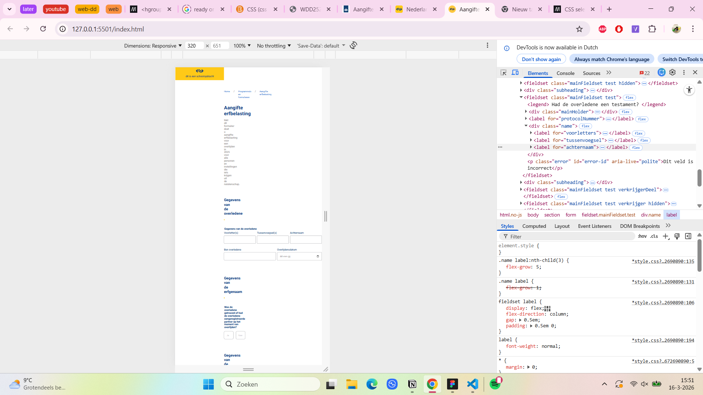
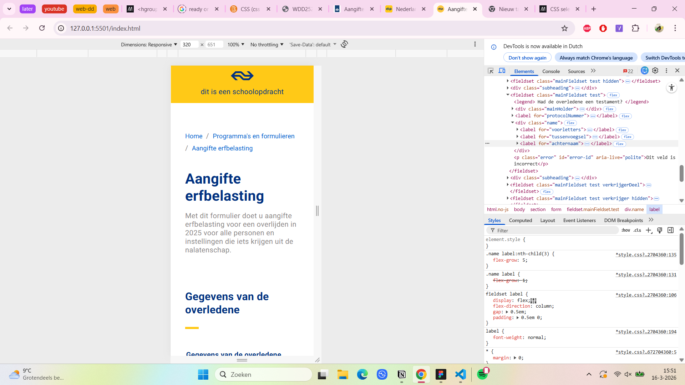
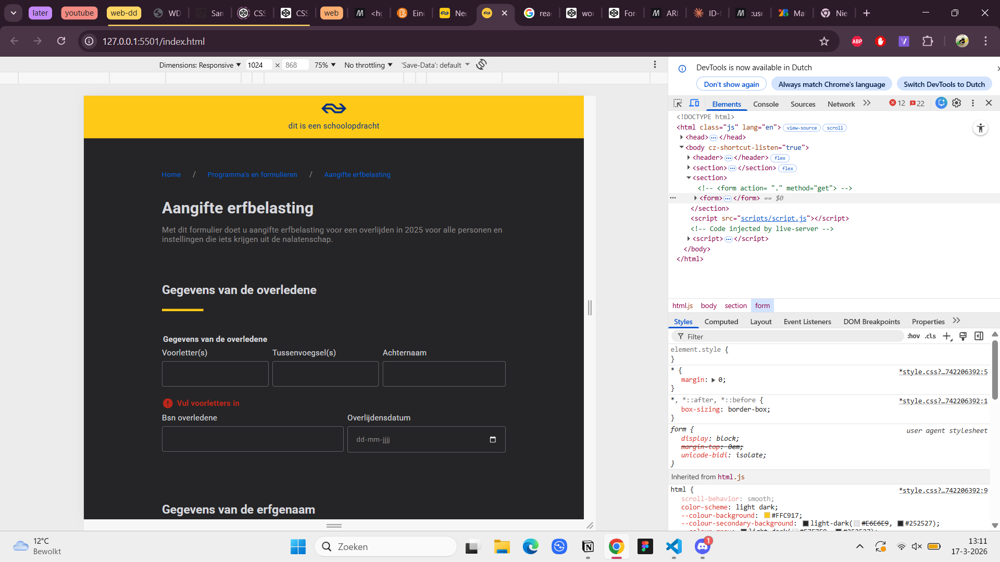

# web-dd-bt-kelly

## Week 2  - maandag 2 maart
- Wat heb ik vandaag gedaan?

ik ben vandaag begonnen aan de opdracht en het was nog vooral inkomen voor mij dus hierdoor heb ik niet heel veel kunnen doen. Het was vooral nog oriënteren en artikelen lezen over forms, maar ik heb al een beginnetje aan de html gemaakt.

Verder had ik nog de workshop van vasilis gevolgd in de ochtend over validatie

- Wat heb ik geleerd?

Ik heb wat geleerd over valideren met html/css en ook nog over fieldset

- Wat ga ik morgen doen?

ik ga voor nu alleen nog focussen op de eerste, dus dan ga ik morgen ook een begin maken aan de styling hierdoor kan ik een beter beeld krijgen over hoe het eruit ziet. verder wil ik werken aan het uitklappen bij de uitsluitende vragen.

## Week 2  - dinsdag 3 maart 
- Wat heb ik vandaag gedaan?

Vandaag hadden we eerst aan de weekly geek gezeten en ben ik gelijk daarna de rest van de vragen in de html gaan zetten. Daarna heb ik gezeten aan de css en heb ik de workshop van Victor gevolgd over valideren. 

De rest van de dag ben ik verder gaan werken aan de css van mn site.

- Hoe lang duurde het?

Het werken aan de css duurde mij wel een tijdje, omdat ik in het begin even niet wist hoe ik het moest aanpakken. Daarna heb ik mijn html een beetje moeten fixen zodat ik het beter kon stylen. Ook was ik de hele tijd niet tevreden. 

- Wat heb ik geleerd?

Mixed states bij checkboxes

- Wat ga ik morgen doen?

Ik ga proberen om te werken aan dat de volgende vraag komt op basis van wat je had beantwoord (progressive disclosure)

## Week 2  - wekelijkse reflectie
Deze week was wel een beetje taai voor mij, want ik wist in het begin niet helemaal waar ik moest beginnen. Voor mij is opstarten vaak wel het probleem en formulieren is voor mij wel een moeilijk ding. Toen ik begon met de styling kwam ik er wel achter dat het makkelijk was voor mij om de motivatie te krijgen om verder te komen. 

Tijdens het voortgang gesprek realiseerde ik me wel dat ik wel wat meer voortgang moest zetten. Vooral qua validatie en de twee patterns. Het zien wat mijn groepje heeft gemaakt gaf mij wel meer inzicht over hoe ik dit kan aanpakken. 

## Week 3 - maandag 09-03-’26

- Wat heb ik vandaag gedaan?

Ik ben vandaag niet heel ver gekomen. Ik heb de styling een beetje aangepast zoals bij de input van de naamvelden. Ook heb ik custom validation toegevoegd. 

- Wat heb ik geleerd?

Ik heb geleerd over custom validatie en het was minder moeilijk dan ik dacht. 

- Wat ga ik morgen doen?

Het was eigenlijk mijn plan om vandaag bezig te gaan met de progressive disclosure, maar dat was mij niet gelukt. Ik hoop dus dat ik daar morgen mee aan de slag kan gaan.

## Week 3  - dinsdag 10-03-’26

- Wat heb ik vandaag gedaan?

vandaag heb ik gewerkt aan de progressive disclosure en het is mij na een tijdje gelukt om als de eerste vraag eerst ja was en daarna nee dat alle vragen dan ingeklapt worden.  Verder heb ik kleine aanpassingen gedaan aan de styling.

Ik heb daarna verder gewerkt aan de gegevens over het testament en probeer daar bezig te gaan met de validatie

- Hoe lang duurde het?

Het duurde mij wel een tijdje, want het lukte mij niet om alle vragen in te laten klappen, maar dit heb ik kunnen fixen door mijn css te nesten.

- Wat heb ik geleerd?

Over css nesting

- Wat ga ik morgen doen?

Nu mijn eerste pattern klaar is ga ik verder met mijn tweede pattern. Ook zou ik meer willen aan de validatie.

## Week 3  - wekelijkse reflectie
Ik heb deze week veel voortgang gemaakt, dus daar ben ik wel blij mee en het ziet er ook redelijk goed uit. Tijdens het feedback gesprek heb ik nog kleine feedbackpunten gekregen die ik kan verwerken zoals de gele onderlijning en over de progressive disclosure. Ik moet nogsteeds wel veel doen zoals de tweede pattern en er moet meer validatie komen. 

Verder ben ik wel heel blij hoe het mij is gelukt met de progressive disclosure, want ik zat er heel erg mee omdat ik niet wist hoe het zonder javascript moest. Maar het nesten van de css heeft heel erg geholpen hiermee. 

## Week 4 - maandag 16-03-’26

- Wat heb ik vandaag gedaan?

Vandaag ben ik aan de slag gegaan met m’n tweede pattern 

- Werkt met en zonder javascript
- Met javascript - twee buttons (toevoegen en verwijderen)
- Zonder javascript - staan er 4 verkrijgers, maar klapt nogsteeds wel uit op basis van ja of nee

Responsiveness

- Light and dark mode
- Oke te zien mobile

Kleine styling aanpassingen

- Nav bar toegevoegd
- Marges en padding
- Kleurcontrast