# Browser Tech
Voor deze schoolopdracht moet ik een formulier maken voor erfbelasting in de stijl van NS door middel van HTML en CSS, maar natuurlijk ook Javascript om het nog beter te maken. Dit formulier moet wel bruikbaar zijn zonder Javascript. Ook moet er een duidelijk focus zijn op usability en accessibility.

## Week 2 | 02-03-2026 maandag
### Wat heb ik vandaag gedaan?

ik ben vandaag begonnen aan de opdracht en het was nog vooral inkomen voor mij dus hierdoor heb ik niet heel veel kunnen doen. Het was vooral nog oriënteren en artikelen lezen over forms, maar ik heb al een beginnetje aan de html gemaakt.

Verder had ik nog de workshop van vasilis gevolgd in de ochtend over validatie

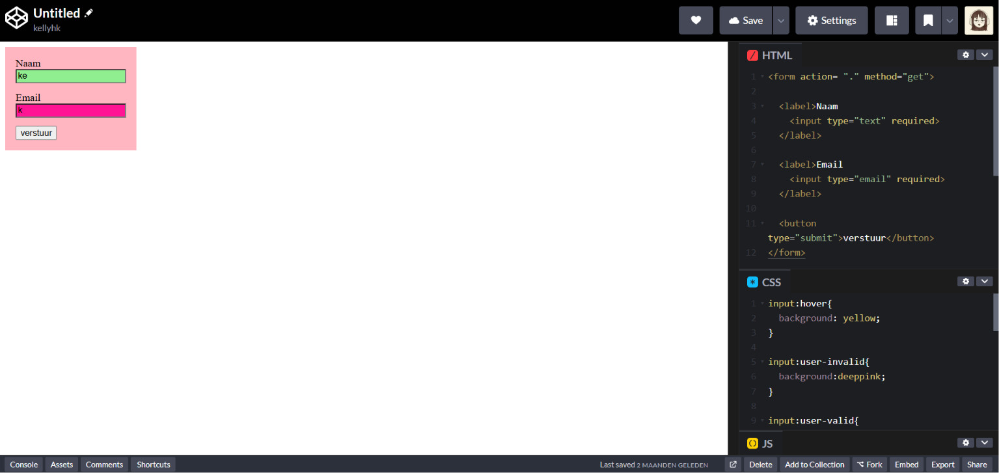

### Wat heb ik geleerd?

Ik heb wat geleerd over valideren met html/css en ook nog over fieldset

### Wat ga ik morgen doen?

ik ga voor nu alleen nog focussen op de eerste pattern, dus dan ga ik morgen ook een begin maken aan de styling hierdoor kan ik een beter beeld krijgen over hoe het eruit ziet. Verder wil ik werken aan het uitklappen bij de uitsluitende vragen.

## Week 2 | 03-03-2026 dinsdag
### Wat heb ik vandaag gedaan?

Vandaag hadden we eerst aan de weekly geek gezeten en ben ik gelijk daarna de rest van de vragen in de html gaan zetten. Daarna heb ik gezeten aan de css en heb ik de workshop van Victor gevolgd over valideren. 

De rest van de dag ben ik verder gaan werken aan de css van mn site.

### Hoe lang duurde het?

Het werken aan de css duurde mij wel een tijdje, omdat ik in het begin even niet wist hoe ik het moest aanpakken. Daarna heb ik mijn html een beetje moeten fixen zodat ik het beter kon stylen. Ook was ik de hele tijd niet tevreden. 

### Wat heb ik geleerd?

Mixed states bij checkboxes

### Wat ga ik morgen doen?

Ik ga proberen om te werken aan dat de volgende vraag komt op basis van wat je had beantwoord (progressive disclosure)

## Week 2 | wekelijkse reflectie
Deze week was wel een beetje taai voor mij, want ik wist in het begin niet helemaal waar ik moest beginnen. Voor mij is opstarten vaak wel het probleem en formulieren is voor mij wel een moeilijk ding. Toen ik begon met de styling kwam ik er wel achter dat het makkelijk was voor mij om de motivatie te krijgen om verder te komen. 

Tijdens het voortgang gesprek realiseerde ik me wel dat ik wel wat meer voortgang moest zetten. Vooral qua validatie en de twee patterns. Het zien wat mijn groepje heeft gemaakt gaf mij wel meer inzicht over hoe ik dit kan aanpakken. 

## Week 3 | 09-03-2026 maandag
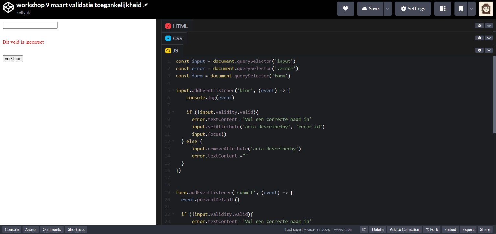

### Wat heb ik vandaag gedaan?

Ik ben vandaag niet heel ver gekomen. Ik heb de styling een beetje aangepast zoals bij de input van de naamvelden. Ook heb ik custom validation toegevoegd. 

### Wat heb ik geleerd?

Ik heb geleerd over custom validatie in javascript bij de workshop van Victor. 
https://codepen.io/kellyhk/pen/raMmpbN

Dit ging over user-invalid en aria-live="polite" en describeby

### Wat ga ik morgen doen?

Het was eigenlijk mijn plan om vandaag bezig te gaan met de progressive disclosure, maar dat was mij niet gelukt. Ik hoop dus dat ik daar morgen mee aan de slag kan gaan.

## Week 3 | 10-03-2026 dinsdag

### Wat heb ik vandaag gedaan?

Vandaag heb ik gewerkt aan de progressive disclosure en het is mij na een tijdje gelukt om als de eerste vraag eerst ja was en daarna nee dat alle vragen dan ingeklapt worden.  Verder heb ik kleine aanpassingen gedaan aan de styling.

Ik heb daarna verder gewerkt aan de gegevens over het testament en probeer daar bezig te gaan met de validatie

### Hoe lang duurde het?

Het duurde mij wel een tijdje, want het lukte mij niet om alle vragen in te laten klappen, maar dit heb ik kunnen fixen door mijn css te nesten.

### Wat heb ik geleerd?

Ik heb vandaag geleerd over CSS nesting

### Wat ga ik morgen doen?

Nu mijn eerste pattern klaar is ga ik verder met mijn tweede pattern. Ook zou ik meer willen aan de validatie.

## Week 3  | wekelijkse reflectie
Ik heb deze week veel voortgang gemaakt, dus daar ben ik wel blij mee en het ziet er ook redelijk goed uit. Tijdens het feedback gesprek heb ik nog kleine feedbackpunten gekregen die ik kan verwerken zoals de gele onderlijning en over de progressive disclosure. Ik moet nogsteeds wel veel doen zoals de tweede pattern en er moet meer validatie komen. 

Verder ben ik wel heel blij hoe het mij is gelukt met de progressive disclosure, want ik zat er heel erg mee omdat ik niet wist hoe het zonder javascript moest. Maar het nesten van de css heeft heel erg geholpen hiermee. 

## Week 4 | 16-03-2026 maandag
### Wat heb ik vandaag gedaan?

Vandaag ben ik aan de slag gegaan met m’n tweede pattern 

- Werkt met en zonder javascript
- Met javascript - twee buttons (toevoegen en verwijderen)
- Zonder javascript - staan er 4 verkrijgers, maar klapt nogsteeds wel uit op basis van ja of nee

Responsiveness

- Light and dark mode
- Oke te zien mobile

Kleine styling aanpassingen

- Nav bar toegevoegd
- Marges en padding
- Kleurcontrast

## Week 4 | 20-03-2026 vrijdag gesprek + reflectie
Vandaag had ik met Victor over mijn site en dit zijn een aantal feedbackpunten die ik nog moet verwerken voor de herkansing.

- Validatie goed erin
- Progressive disclosure validatie erin
- Toevoegen van verkrijgers op de juiste manier (met juiste validatie)
- Kijk eens naar scrollInToView() <- javascript
- Dark/light mode switch?

Dit was een korte week en heb ik vooral gezeten aan het responsive maken van de site aangezien het op mobiel nog niet te zien was en heb ik ook een darkmode gemaakt ervoor. Ik heb deze week ook gewerkt aan mijn tweede pattern, maar na het gesprek bleek dat mijn tweede pattern niet voldoende was zoals je kan wel verkrijgers toevoegen en verwijderen maar niet bijvoorbeeld verkrijger 2 als je er 3 hebt, dus dan zou je nummer 3 ook moeten verwijderen.

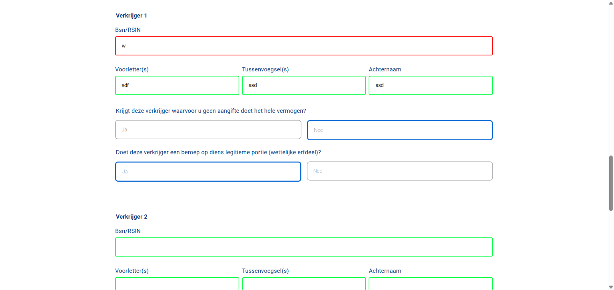

Verder werkt de validatie nog niet helemaal goed zoals er in de screenshot te zien is. Alhoewel de styling van de site al prima is werkt de flow toch niet helemaal goed en dat is iets waar ik beter over na moet denken. Ik vind het toch wel lastig om javascript validatie te doen, maar ik ga voor de herkansing proberen om dat meer te verwerken.

## Waar heb ik aan gewerkt sinds de herkansing?
- Met javascript de verborgen buttons zijn nu disabled als ze verborgen zijn, dus ze worden dan niet meegestuurd & geldt ook de voor de verkrijgers
- Verkrijgers zijn nu met de javascript individueel verborgen
- Focus op de radio buttons door ze niet op display:none te zetten maar positon absolute en width en height 0, maar wel een focus state toevoegen. Want kon er eerst niet komen met keyboard alleen.
- Het is niet mogelijk om de hidden radio buttons alleen required te maken zonder javascript. Ik heb het geprobeerd met hidden class en html hidden atrribute. Dit is iets dat ik wel ga doen als er wel javascript is voor de progressive enhanchement.

- gegevens testament klapt nu ook in en uit op basis van antwoord
- alleen mogelijk om letters in te typen bij voorletters en achternaam anders geeft het een error
- toelichting bij vragen door middel van details summary

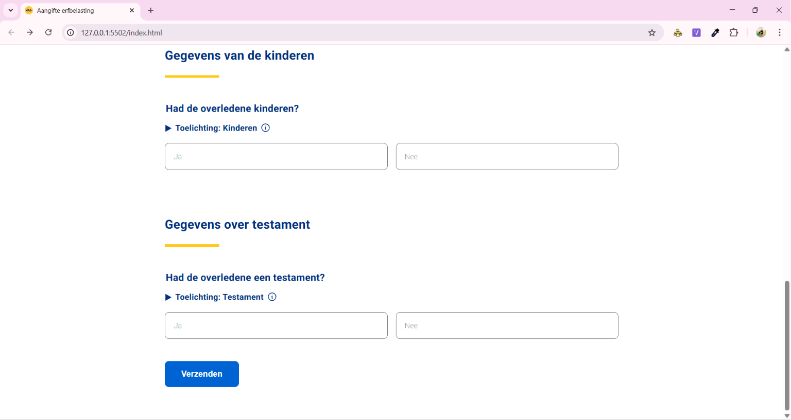
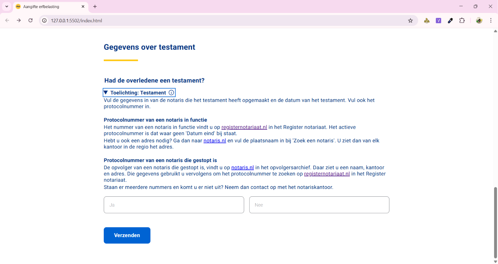

- javascript validatie

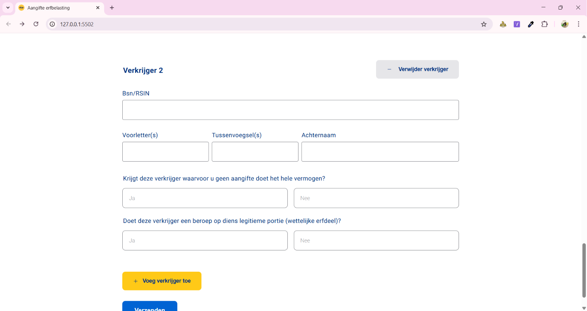

- javascript voegt required toe aan verkrijgers als ze toegevoegd worden & individueel te verwijderen

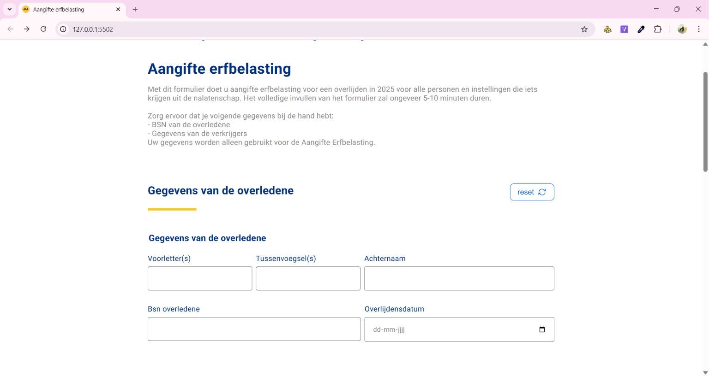

- local storage en een reset button 
- styling verbeterd
- light en dark mode
- aria-invalid true en aria describeby toegevoegd

### to do's
- reset button bevestiging
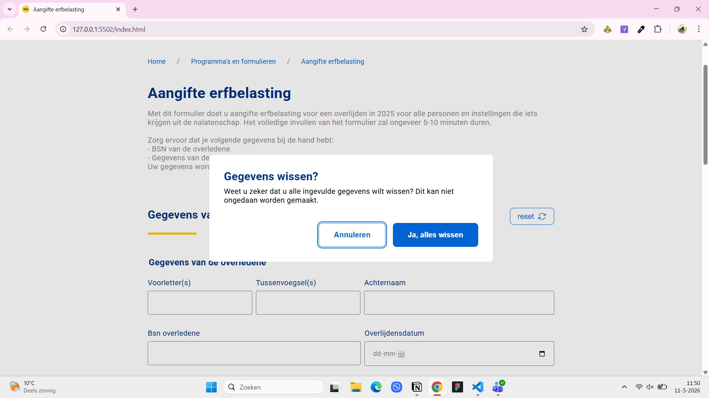
Ik had met de local storage nog een reset button toegevoegd, maar eerst resetten het gewoon gelijk en dat is gewoon niet handig bij een formulier. Stel dat alles is ingevuld en dat klik je perongeluk op de reset knop. Ik heb dus daarom met dialog nog een popup gemaakt die even nog een bevestiging vraagt.

- styling van de buttons aanpassen -> radiobuttons
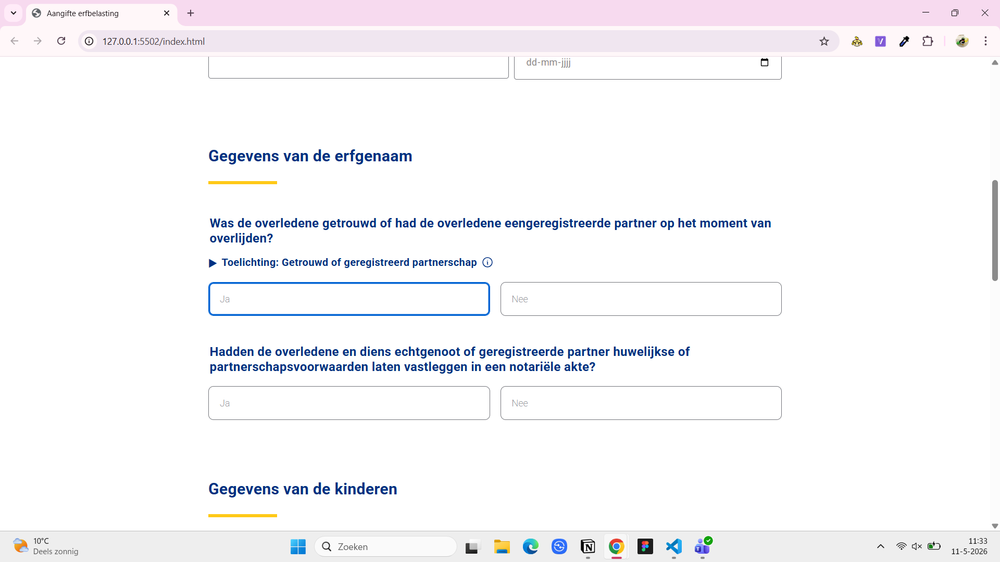
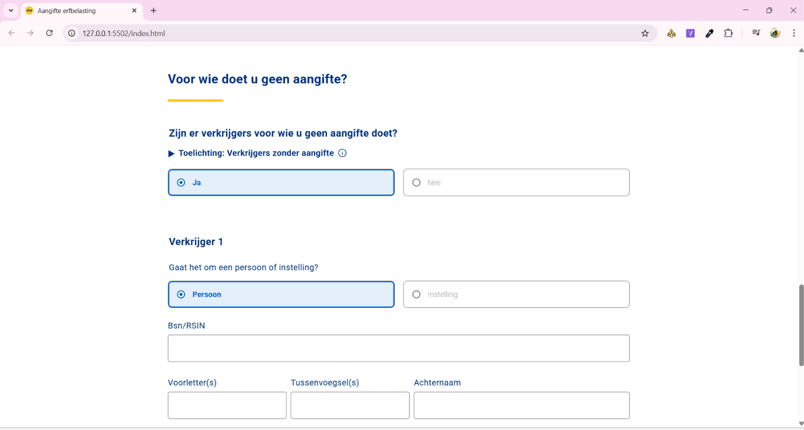

Ik kreeg van veel mensen feedback dat de radiobuttons te veel leken op inputvelden en hierdoor raakten ze verward. Ik heb dit aan Vasilis nagevraagd en hij vertelde dat een oplossing om dit op te lossen zou kunnen zijn om het een radio button te maken. Dit maakt het in een oogopslag toch wel duidelijker.

- persoon instelling

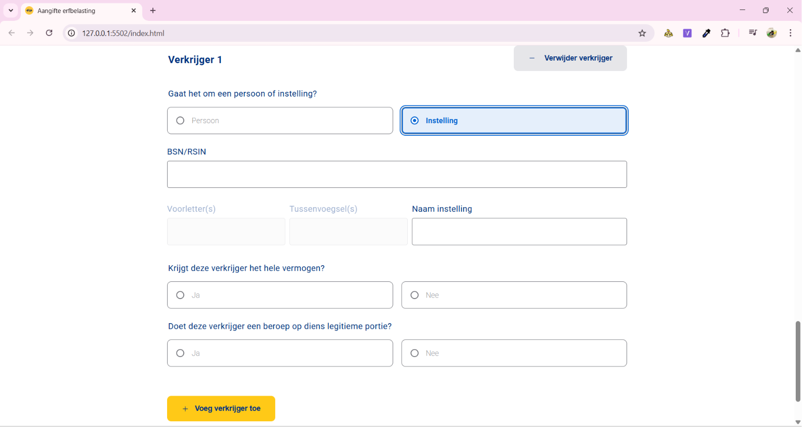

Wanneer er geklikt word op instelling dan verandert de achternaam naar naam instelling en de voorletters en tussenvoegsel worden allebei disabled.

- oneindig aantal verkrijgers kunnen toevoegen met javascript

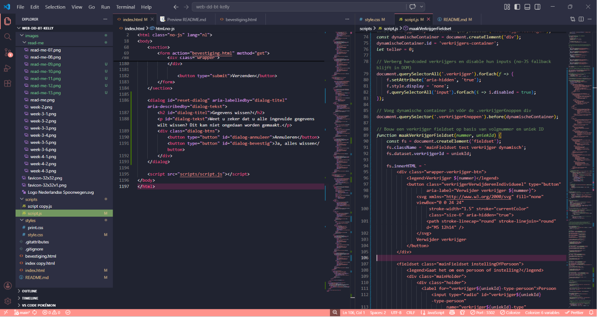

Ik heb dit door middel van de code die Victor heeft gestuurd via teams! De html wordt opgebouwd met innerhtml en iedere krijft een andere id!

## Reflectie
Dit was echt een hele uitdagende opdracht voor mij. Ik had nog nooit eerder gewerkt met validatie, dus in het begin was ik erg verward en snapte ik niet goed hoe ik het moest aanpakken. Uiteindelijk heb ik wel veel geleerd over validatie, vooral met HTML/CSS en toegankelijkheid. Dingen zoals aria-describedby, aria-live, aria-invalid, :user-invalid en pattern waren helemaal nieuw voor mij. Javascript-validatie vind ik nog steeds lastig en ik twijfel soms of ik het op de juiste manier heb toegepast, maar ik merk wel dat ik er veel meer van begrijp dan aan het begin van dit project.

Tijdens dit project heb ik ook gewerkt aan progressive disclosure. Dat vond ik in het begin erg moeilijk, vooral omdat het ook zonder Javascript moest werken. Uiteindelijk is het mij gelukt om vragen uit en in te klappen op basis van eerdere antwoorden. Ik was daar wel trots op, omdat ik hier eerst echt op vastliep. Ook het individueel toevoegen en verwijderen van verkrijgers met Javascript was iets waar ik veel van heb geleerd.

Gelukkig heb ik bij het vak API localstorage geleerd en heb ik dat ook een beetje kunnen verwerken voor dit project alhoewel het toch net wat anders was.

Ik heb toelichtingen gewerkt met iets nieuws voor mij en dat was  
en summary

Wat ik vooral heb geleerd, is dat formulieren maken veel moeilijker is dan ik van tevoren dacht. Er komt veel meer kijken bij gebruiksvriendelijkheid, validatie en toegankelijkheid dan alleen “een paar inputs neerzetten”. Ik heb tijdens deze opdracht vaak getwijfeld over mijn aanpak, maar ik denk dat ik het uiteindelijk goed heb aangepakt. Voor een volgende keer weet ik in ieder geval dat ik formulieren en validatie niet meer moet onderschatten.

## Bronnen
- https://developer.mozilla.org/en-US/docs/Web/HTML/Reference/Elements/fieldset
- https://developer.mozilla.org/en-US/docs/Web/CSS/Guides/Selectors

- https://developer.mozilla.org/en-US/docs/Learn_web_development/Extensions/Forms/Form_validation
- https://developer.mozilla.org/en-US/docs/Web/JavaScript/Reference/Global_Objects/Array/forEach voor de aanroep van koppelValidatie op elk veld, zodat we niet voor elk veld aparte code hoeven te schrijven
- Zet required op de juiste velden https://claude.ai/chat/b0f93038-9c6d-4b8b-af11-d5a1787aaa4b
- https://claude.ai/chat/106d79d1-e0c6-4f9e-93aa-e5a424ccea49 Hulpfunctie: reset alle radio's binnen een fieldset en verberg hem
- https://developer.mozilla.org/en-US/docs/Web/API/Window/localStorage
- https://developer.mozilla.org/en-US/docs/Web/API/Event/bubbles
- https://developer.mozilla.org/en-US/docs/Web/API/EventTarget/dispatchEvent
- https://developer.mozilla.org/en-US/docs/Web/API/Element/closest